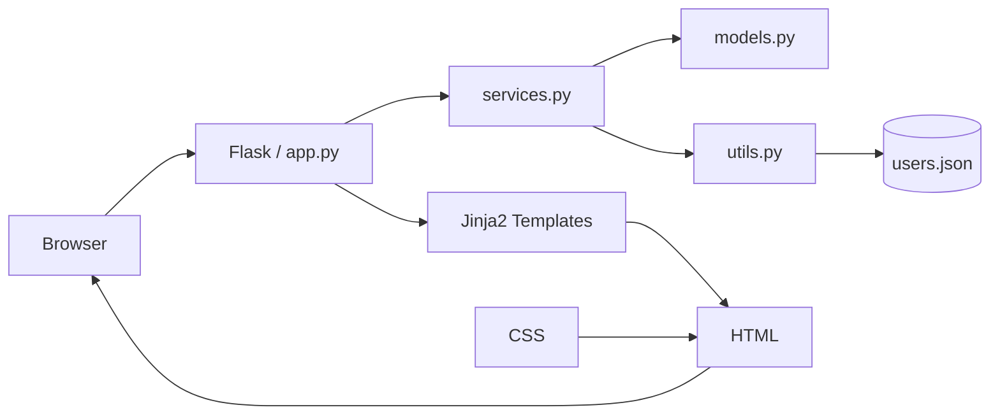

# University Manager

University Manager — учебный веб-проект на Python и Flask для управления студентами и преподавателями университета.

Проект начинался как консольное приложение, а затем был переработан в веб-приложение с HTML, CSS, Flask и Jinja2.

---

## Возможности

- просмотр студентов и преподавателей;
- добавление новых пользователей;
- редактирование данных;
- удаление пользователей;
- поиск;
- статистика университета;
- хранение данных в JSON;
- валидация данных;
- логирование действий и ошибок.

---

## CRUD

В проекте реализованы основные CRUD-операции:

- **Create** — добавление студентов и преподавателей;
- **Read** — просмотр данных;
- **Update** — редактирование;
- **Delete** — удаление.

---

## Технологии

### Backend

- Python
- Flask
- Jinja2
- OOP

### Frontend

- HTML5
- CSS3
- Flexbox

### Data

- JSON

### Дополнительно

- Git
- GitHub
- Logging
- Exception Handling

---

## Архитектура приложения



---

## Структура проекта

```text
UniversityCLI/
├── app.py
├── models.py
├── services.py
├── utils.py
├── logger.py
│
├── data/
│   └── users.json
│
├── templates/
│   ├── base.html
│   ├── index.html
│   ├── students.html
│   ├── teachers.html
│   ├── statistics.html
│   ├── add_student.html
│   ├── add_teacher.html
│   ├── edit_student.html
│   └── edit_teacher.html
│
├── static/
│   └── css/
│       └── style.css
│
├── .gitignore
└── README.md
```

---

## Основные файлы

### `app.py`

Главный файл Flask-приложения.

Отвечает за:

- маршруты;
- обработку HTTP-запросов;
- GET и POST;
- работу с HTML-шаблонами;
- добавление;
- редактирование;
- удаление;
- поиск;
- статистику;
- перенаправления между страницами.

### `models.py`

Содержит классы:

- `User`
- `Student`
- `Teacher`

Используются принципы ООП:

- наследование;
- инкапсуляция;
- абстракция;
- полиморфизм.

Также реализована валидация данных:

- имени;
- фамилии;
- возраста;
- email;
- курса;
- GPA;
- стажа преподавателя.

### `services.py`

Содержит бизнес-логику приложения:

- добавление пользователя;
- поиск по ID;
- обновление;
- удаление;
- поиск;
- получение студентов;
- получение преподавателей.

### `utils.py`

Отвечает за:

- загрузку пользователей из JSON;
- сохранение пользователей в JSON;
- восстановление объектов `Student` и `Teacher` из сохранённых данных.

### `logger.py`

Отвечает за логирование:

- добавления;
- удаления;
- редактирования;
- поиска;
- ошибок;
- проблем с валидацией;
- работы с JSON.

### `templates/`

Содержит HTML-шаблоны Flask и Jinja2.

Используются:

- переменные;
- циклы;
- условия;
- наследование шаблонов;
- вывод данных из Python.

### `static/`

Содержит CSS-файлы и отвечает за внешний вид приложения.

---

## Как работает приложение

Пользователь открывает страницу в браузере.

Flask принимает запрос, вызывает нужный маршрут, использует бизнес-логику и данные, после чего передаёт результат в HTML-шаблон.

```text
Browser
   ↓
Flask
   ↓
app.py
   ↓
services.py
   ↓
models.py / utils.py
   ↓
users.json
```

После обработки данных:

```text
Python objects
     ↓
render_template()
     ↓
Jinja2
     ↓
HTML + CSS
     ↓
Browser
```

---

## Основные страницы

| URL | Назначение |
|---|---|
| `/` | Главная страница |
| `/students` | Список студентов |
| `/students/add` | Добавление студента |
| `/students/edit/<id>` | Редактирование студента |
| `/students/delete/<id>` | Удаление студента |
| `/teachers` | Список преподавателей |
| `/teachers/add` | Добавление преподавателя |
| `/teachers/edit/<id>` | Редактирование преподавателя |
| `/teachers/delete/<id>` | Удаление преподавателя |
| `/statistics` | Статистика университета |

---

## Поиск

Поиск работает через GET-параметр.

Пример:

```text
/students?q=Ali
```

Flask получает значение через:

```python
request.args.get("q")
```

После этого используется поиск из `services.py`.

---

## Статистика

На странице статистики отображается:

- общее количество пользователей;
- количество студентов;
- количество преподавателей;
- средний GPA;
- лучший студент по GPA.

---

## Пример Student

```json
{
    "type": "student",
    "user_id": 1001,
    "first_name": "Mizbonshoh",
    "last_name": "Murzoev",
    "age": 19,
    "email": "mizbonshoh@example.com",
    "faculty": "Computer Science",
    "course": 2,
    "gpa": 4.8
}
```

---

## Пример Teacher

```json
{
    "type": "teacher",
    "user_id": 2001,
    "first_name": "Abdullo",
    "last_name": "Rahimov",
    "age": 45,
    "email": "abdullo.rahimov@example.com",
    "department": "Computer Science",
    "subject": "Python",
    "experience": 18
}
```

---

## Установка

Клонировать репозиторий:

```bash
git clone https://github.com/mzbnsz/UniversityCLI.git
```

Перейти в папку проекта:

```bash
cd UniversityCLI
```

Создать виртуальное окружение:

```bash
python3 -m venv .venv
```

Активировать виртуальное окружение:

```bash
source .venv/bin/activate
```

Установить Flask:

```bash
pip install flask
```

---

## Запуск

Запустить приложение:

```bash
python app.py
```

После запуска открыть:

```text
http://127.0.0.1:5000
```

---

## Что изучается в проекте

- Python
- ООП
- Flask
- HTML
- CSS
- Flexbox
- Jinja2
- HTTP
- GET
- POST
- CRUD
- JSON
- Git
- GitHub
- Logging
- Exception Handling
- архитектура веб-приложений

---

## Дальнейшее развитие

Планируется:

- улучшенный поиск;
- фильтрация;
- сортировка;
- улучшение интерфейса;
- PostgreSQL вместо JSON;
- SQLAlchemy;
- Flask Blueprints;
- авторизация;
- REST API;
- тестирование;
- Docker;
- деплой.

---

## Автор

**Mizbonshoh Murzoev**

Python Backend Developer
